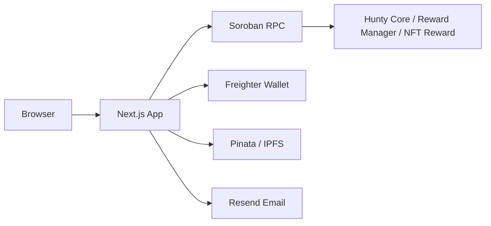

# Hunty

[](LICENSE)
[](https://nextjs.org/)
[](https://expo.dev/)
[](https://soroban.stellar.org/)
[](https://codecov.io/gh/Samuel1-ona/hunty)

Hunty is a cross-platform scavenger-hunt platform and dApp that combines web, mobile, and on-chain rewards. Creators publish location-based hunts and players complete challenges to earn NFTs, tokens, and other reward assets via Stellar/Soroban.

## Highlights

- **Multi-platform:** Web app built with Next.js App Router and a React Native mobile app in `mobile/`.
- **On-chain rewards:** Stellar/Soroban smart-contract integrations, wallet adapters, and NFT reward flows.
- **Decentralized assets:** IPFS-hosted media and metadata for hunts, NFTs, and rewards.
- **Developer tooling:** Type-safe TypeScript code, Vitest unit tests, and Playwright E2E tests.

## Key Features

- Create, publish, and manage hunts from a creator dashboard.
- Schedule hunts with start/end datetimes, timezone-aware display, countdowns for upcoming hunts, and reminder emails before launch.
- Play hunts with location and clue validation, progress tracking, and completion flows.
- Share hunt referral links tied to a wallet address and track invite bonuses on the player profile.
- Attach image, audio, or video media to clue cards through the existing IPFS upload flow.
- Promote active hunts into a 24-hour spotlight carousel from the creator dashboard.
- Mint and claim NFT rewards and on-chain token payouts for completed hunts.
- Track creator payouts from a consolidated dashboard: total escrowed, paid, refunded, and remaining per hunt, with on-chain transactions linked to the explorer and figures reconciled against on-chain escrow state.
- Community and leaderboard features for social play and competition.

## Tech Stack

- Frontend: Next.js, React, TypeScript
- Mobile: Expo / React Native
- Storage: IPFS for media and metadata
- Blockchain: Stellar + Soroban smart contracts, Freighter wallet support
- Testing: Vitest for unit tests, Playwright for E2E
- Tooling: pnpm, Tailwind CSS, PostCSS

## Repository Structure

This is a [Turborepo](https://turbo.build/) monorepo. Shared code lives in `packages/`, deployable apps live in `apps/`.

```
hunty/
├── apps/
│   ├── web/          # Next.js 15 App Router web application
│   └── mobile/       # Expo React Native mobile app
├── packages/
│   ├── types/        # Shared TypeScript domain types and Zod schemas
│   ├── ui/           # Shared UI component library (web + native)
│   └── config/       # Shared ESLint, TypeScript, and Tailwind configs
├── turbo.json        # Turborepo task pipeline
└── package.json      # Root workspace config and scripts
```

### Workspaces

| Package | Name | Description |
|---------|------|-------------|
| [`apps/web`](./apps/web) | `@hunty/web` | Web app — Next.js 15 App Router with creator dashboard, hunt play, NFT minting, leaderboards, and Stellar wallet integration. |
| [`apps/mobile`](./apps/mobile) | `mobile` | Mobile app — Expo React Native with camera, location, notifications, maps, and WalletConnect support. |
| [`packages/types`](./packages/types) | `@hunty/types` | Shared domain types, Zod validation schemas, and TypeScript type guards used by both apps. |
| [`packages/ui`](./packages/ui) | `@hunty/ui` | Cross-platform component library exporting `web`, `native`, and shared `tokens` entry points. |
| [`packages/config`](./packages/config) | `@hunty/config` | Centralized ESLint, TypeScript, and Tailwind CSS configurations consumed by all workspaces. |

### Dependency direction

```
types  ←  ui  ←  web
types           ←  mobile
config  ←  (all workspaces)
```

- `@hunty/types` is the leaf — no internal dependencies.
- `@hunty/ui` depends on `@hunty/types`.
- `@hunty/web` depends on `@hunty/types`, `@hunty/ui`, and `@hunty/config`.
- `@hunty/config` is consumed as a devDependency by all workspaces for shared tooling config.

## Getting Started

### Prerequisites

- **Node.js 18+** and **pnpm 9+** (this repo uses pnpm workspaces)
- Git
- For blockchain features: Stellar wallet (e.g., Freighter)
- For file uploads: Pinata account ([Get API key](https://pinata.cloud))
- For email features: Resend account ([Get API key](https://resend.com))

### Installation

1. Clone the repository:

```bash
git clone https://github.com/Samuel1-ona/hunty.git
cd hunty
```

2. Install all workspace dependencies from the root:

```bash
pnpm install
```

3. Set up environment variables:

```bash
cp .env.example .env.local
```

Open `.env.local` and configure your environment variables. See `.env.example` for detailed documentation of all available options. Key variables include:

- **PINATA_JWT** — Required for IPFS file uploads
- **RESEND_API_KEY** — Required for email notifications
- **NEXT_PUBLIC_WC_PROJECT_ID** — Required for WalletConnect support
- **DATABASE_URL** — PostgreSQL connection string
- **Contract addresses** — Your deployed Soroban smart contract addresses

For detailed setup instructions, see [DEVELOPMENT.md](./DEVELOPMENT.md).

4. Run all apps in development:

```bash
pnpm dev
```

This uses Turborepo to run `dev` in every workspace concurrently. The web app is available at `http://localhost:3000`.

5. Start only the mobile app:

```bash
pnpm --filter mobile start
```

6. Run tests:

```bash
pnpm test            # unit tests across all workspaces
pnpm run test:coverage
pnpm run e2e          # Playwright E2E (web only)
```

The local coverage command writes an HTML report to `coverage/index.html`.

6. Run Storybook for isolated UI documentation:

```bash
pnpm run storybook
pnpm run build-storybook
```

Storybook includes the `components/ui/` primitives plus `Header`, `HuntCards`, `GameCompleteModal`, and `WalletModal` stories for contributor review. If you use Chromatic or GitHub Pages in CI, publish the static `storybook-static/` output from `pnpm run build-storybook`.

### Hunt scheduling

Creators can now define a hunt start and end time in their local timezone. The app stores those values in UTC internally and displays them for viewers in their browser timezone. Scheduled hunts automatically transition through `scheduled` → `active` → `ended`, and the reminder API can send a start-notice email to the creator ahead of launch.

## Docker development

The web app includes a local Docker development environment with a PostgreSQL database container.

1. Build and start the development stack:

```bash
docker compose up --build
```

2. Open the web app at `http://localhost:3000`.

3. PostgreSQL is available at `localhost:5432` with:

- `POSTGRES_USER=hunty`
- `POSTGRES_PASSWORD=hunty`
- `POSTGRES_DB=hunty_dev`

4. Code changes are mounted from the host into the container, so hot reload works automatically.

5. Stop the stack:

```bash
docker compose down
```

## Root scripts

All root scripts delegate to [Turborepo](https://turbo.build/) and run across every workspace:

| Command | Description |
|---------|-------------|
| `pnpm dev` | Start all apps in development mode (no cache, persistent) |
| `pnpm build` | Production build of all workspaces (respects `^build` dependency graph) |
| `pnpm start` | Start built apps |
| `pnpm lint` | Lint all workspaces |
| `pnpm typecheck` | Run TypeScript type-checking across all workspaces |
| `pnpm test` | Run unit tests across all workspaces |
| `pnpm run test:coverage` | Run tests with coverage output |
| `pnpm clean` | Remove build artifacts (`.next/`, `dist/`, etc.) |

Run a command in a single workspace with `--filter`:

```bash
pnpm --filter @hunty/web build
pnpm --filter mobile test
```

See [turbo.json](./turbo.json) for the full task pipeline configuration.

## Notes

- This project is managed with **pnpm workspaces** and **Turborepo**; the lockfile is `pnpm-lock.yaml`.
- On-chain reward flows require wallet integrations and a local or testnet Stellar environment.
- The `@hunty/types` and `@hunty/ui` packages use `workspace:*` protocol so local changes propagate immediately during development.

## Roadmap

- Finalize and audit Soroban reward contracts.
- Improve on-chain UX with clearer signing prompts and gasless flows.
- Add persistent IPFS pinning and CDN fallback for asset availability.
- Expand mobile parity with offline play support.
- Add creator templates, analytics, and better minting tools.
- Build community features like messaging, team hunts, and governance.

## Documentation

- See [`docs/`](./docs/) for detailed guides on achievements, security, testing, and development setup.
## Architecture



## Deployment

- See [docs/deployment.md](./docs/deployment.md) for production deployment guidance.
- Vercel is the recommended hosting path for the web app.

## Contributing

- See `CONTRIBUTING.md` for contribution guidelines.
- Use branches for feature work and include tests with focused changes.

## Contact

- Open issues or PRs on the repository.
- Tag maintainers for urgent review requests.

## License

This project is open source under the MIT License.
